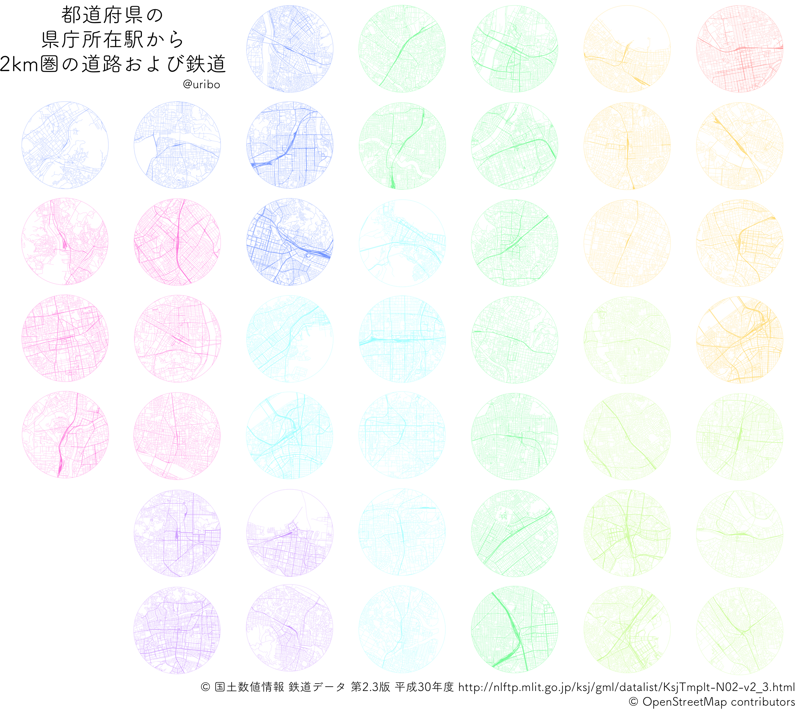

46都道府県の県庁所在駅周辺の道路・鉄道網
================

<p align="center"><br>各県の県庁所在駅からの範囲2kmに含まれる道路・鉄道網を可視化しました。<br></p>

## Source

- 各県の県庁所在駅座標... 国土数値情報 鉄道データ 第2.3版 平成30年度 http://nlftp.mlit.go.jp/ksj/gml/datalist/KsjTmplt-N02-v2_3.html
- 道路・鉄道網... OpenStreetMap contributors

## Session Info

``` r
sessioninfo::session_info()
#> ─ Session info ──────────────────────────────────────────────────────────
#>  setting  value                       
#>  version  R version 3.6.0 (2019-04-26)
#>  os       macOS Mojave 10.14.6        
#>  system   x86_64, darwin18.6.0        
#>  ui       unknown                     
#>  language En                          
#>  collate  ja_JP.UTF-8                 
#>  ctype    ja_JP.UTF-8                 
#>  tz       Asia/Tokyo                  
#>  date     2019-08-13                  
#> 
#> ─ Packages ──────────────────────────────────────────────────────────────
#>  ! package     * version date       lib source          
#>  P assertthat    0.2.1   2019-03-21 [?] CRAN (R 3.6.0)  
#>  P cli           1.1.0   2019-03-19 [?] CRAN (R 3.6.0)  
#>  P crayon        1.3.4   2017-09-16 [?] CRAN (R 3.6.0)  
#>  P digest        0.6.20  2019-07-04 [?] CRAN (R 3.6.0)  
#>  P evaluate      0.14    2019-05-28 [?] CRAN (R 3.6.0)  
#>  P highr         0.8     2019-03-20 [?] CRAN (R 3.6.0)  
#>  P htmltools     0.3.6   2017-04-28 [?] CRAN (R 3.6.0)  
#>  P knitr         1.24    2019-08-08 [?] standard (@1.24)
#>  P magrittr      1.5     2014-11-22 [?] CRAN (R 3.6.0)  
#>  P Rcpp          1.0.2   2019-07-25 [?] CRAN (R 3.6.0)  
#>  P rmarkdown     1.14    2019-07-12 [?] CRAN (R 3.6.0)  
#>  P sessioninfo   1.1.1   2018-11-05 [?] CRAN (R 3.6.0)  
#>  P stringi       1.4.3   2019-03-12 [?] CRAN (R 3.6.0)  
#>  P stringr       1.4.0   2019-02-10 [?] CRAN (R 3.6.0)  
#>  P withr         2.1.2   2018-03-15 [?] CRAN (R 3.6.0)  
#>  P xfun          0.8     2019-06-25 [?] CRAN (R 3.6.0)  
#>  P yaml          2.2.0   2018-07-25 [?] CRAN (R 3.6.0)  
#> 
#> [1] /Users/suryu/Documents/projects2019/urbanspacemap/renv/library/R-3.6/x86_64-apple-darwin18.6.0
#> [2] /private/var/folders/79/85f_10c96bg65_s5y11ttxyc0000gp/T/RtmpuisOSL/renv-system-library
#> [3] /usr/local/Cellar/r/3.6.0_3/lib/R/library
#> 
#>  P ── Loaded and on-disk path mismatch.
```
